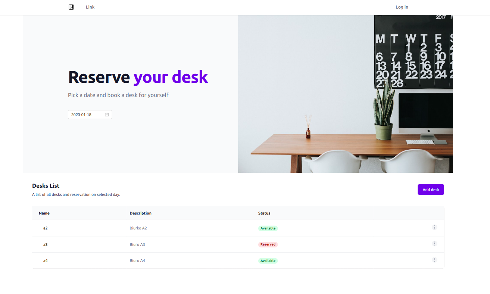

# WkReservationApp

## Config

Change `.env` database data.

## Development

Run `npm run dev` to run develop.

## Build

Run `npm run build` to run.

## Technology stack

Turborepo, Typescript, React, Redux, Tailwind, NestJs, typeorm, MySql.
